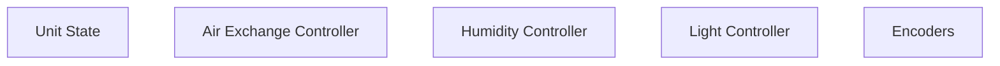
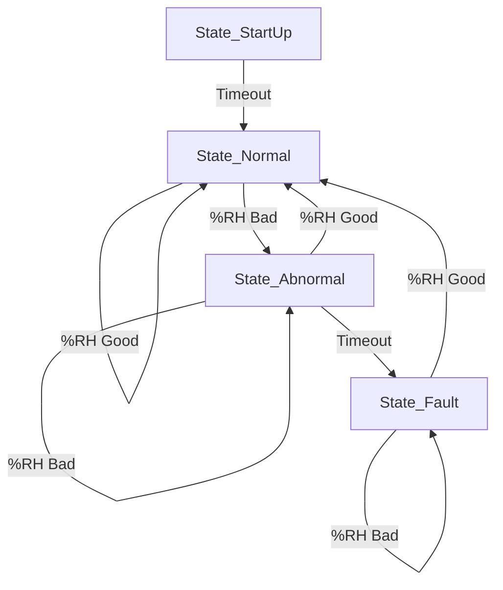

# Mella
Mella is a mushroom growing chamber designed at FirstBuild. The chamber provides a humidity, light, and fresh air controlled environment that allows users to customize the conditions to promote growth of a multitude of mushroom species.

## License
See [LICENSE](LICENSE) for important details.

## Software Structure
The software is made up of a few main components/modules:

### Unit State
The primary purpose of this state machine is to maintain the system status.

Upon startup, the State Machine enters `State_Startup` for a parametrically-defined time. After startup, the unit enters `State_Normal`. While in this state, the humidity is periodically checked. If the humidity value falls outside the parametrically-defined range, the unit will enter `State_Abnormal` and remain in that state until the humidity returns to the normal range or a parametrically-defined timeout occurs. If the timeout occurs, the unit will enter `State_Fault`. While in this state, the lighting will be set to Error Mode. If the humidity re-enters the normal range, the unit will immediately return to `State_Normal`.

### Air Exchange Controller
This controller simply controls the fresh air exchange fan in accordance with the knob setting. In a future update, the fan will be set to only run for a parametrically-defined period of time.

### Humidity Controller
Mella uses a SHT31 temperature/humidity sensor for closed loop control. Measurements from the sensor are fed back into a parametrically-defined PID loop whose output controls the humidity fan.

During operation, the humidity controller will periodically measure relative humidity and control the humidity fan in an attempt to maintain the humidity setpoint defined by the encoder knob position. The Humidity Controller is responsible for determining if the humidity falls within the parametrically-defined normal range.

### Light Controller
The light controller handles the lighting modes and animations. The state machine will request either Error Mode or Normal Mode. Based on this request, the light controller will adjust how it controls both the chamber light as well as the PCB heartbeat LED. In Normal Mode, the chamber lights will remain on and the intensity will be set based on the encoder position. The heartbeat LED will blink in 1 second intervals. In Error Mode, the chamber lights will slowly pulsate/bounce to notify the user of an issue. Additionally, the heartbeat LED will begin blinking ten times per second.

### Encoders
All three controllers (Air Exchange, Humidity, and Light) get their setpoint from the user via a set of three 16-position absolute encoders.
The knob being in the 6 o'clock position equates to off. The remaining 15 positions represent equally spaced values from the minimum to maximum values for the respective controllers.

## Logging
Mella provides periodic logging of data in CSV format. When logging occurs, the output of each module is printed to the output. This log can be accessed via the Mini USB port as a serial UART with a baud rate of 115200.

## Building
This project uses PlatformIO and can be built using the PlatformIO build function.

## Programming
For programming, it is recommended that you use the AVRISP mkII programmer or similar. There is a 6-pin programming header (J24) on the PCB under the control knob cover. The 6-pin programming cable can be plugged directly into this header with the red wire on the programming cable (pin 1) toward back of the Mella. Note: the PCB needs DC power for programming to work.
